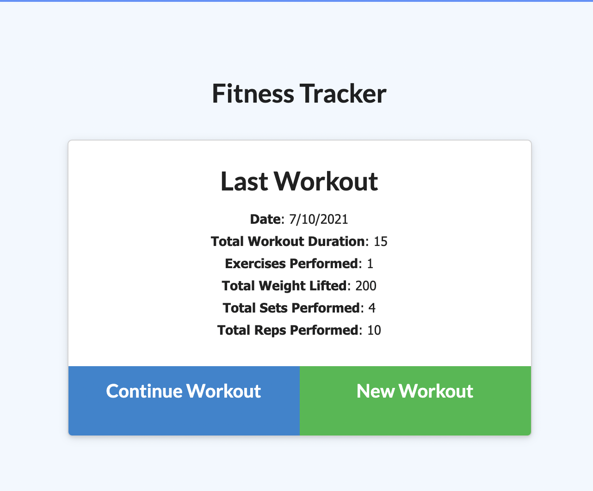
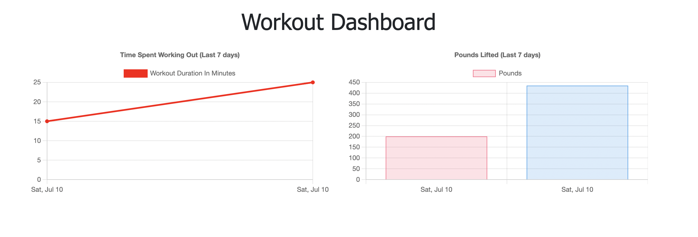

# Workout Tracker Project

## Table of Contents
            
- [Description](#Description)
- [Usage](#Usage)
- [Questions](#Questions)

### Description
For this project, I was tasked to finish an application that will allow the user to track their workouts. To finish this app, a proper mongoDB database and model needed to be added. To do this I started by creating the model. I created a workout schema that read the date and exercise. For the exercise, I took note of the name, duration, weight, reps, sets, and distance travelled. After the model was created and exported, I created a route in the server.js to show this information on the screen. Using a get route with the aggregate for mongo, I was able to pull in all of the information and tally the totals for weight, duration, reps, and etc to display on the home screen.

I then worked on creating routes for the continue workout and new workout buttons. To do this, I created a put and post route with the find one and update and create from mongoose to get these buttons working. After setting up the req.body to take in this information the buttons were working and new workouts could be added.

Finally, I polished up the stats page with a similar route to the one used for the home page with the addition of a sort that looked for the last 7 workouts and reversed the order of display so that it is easier to read. With the aggregate on this route, it allowed the stats page to display the same stats as the home but with graphs that create a more visually appealing format.

### Usage
To use this application, you need to open the app from heroku and select the new workout button. Continue to build your workout or return the the main page and add multiple workouts. Once you are done, all of the totals for the last workout added will be displayed on the main screen, but if you go to the dashboard, you will see the stats page with the last 7 workouts displayed.

Here is a link to the depolyed application: https://mysterious-island-19383.herokuapp.com/

### Questions
My Github: https://github.com/morrisbianco

andrewbianco98@gmail.com: Please contact me through this E-mail address with any further questions that you may have.